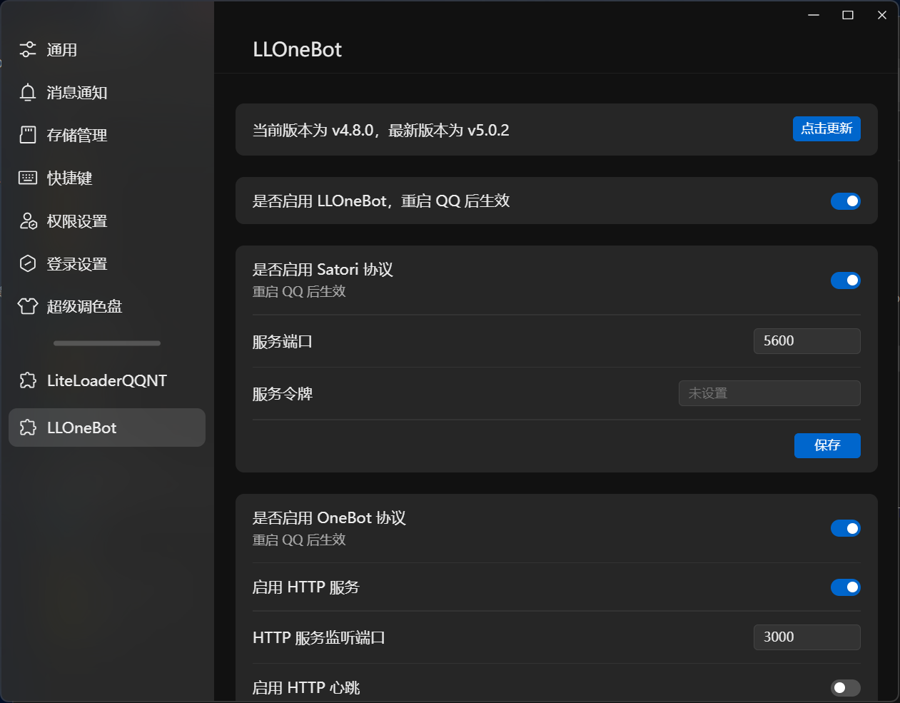
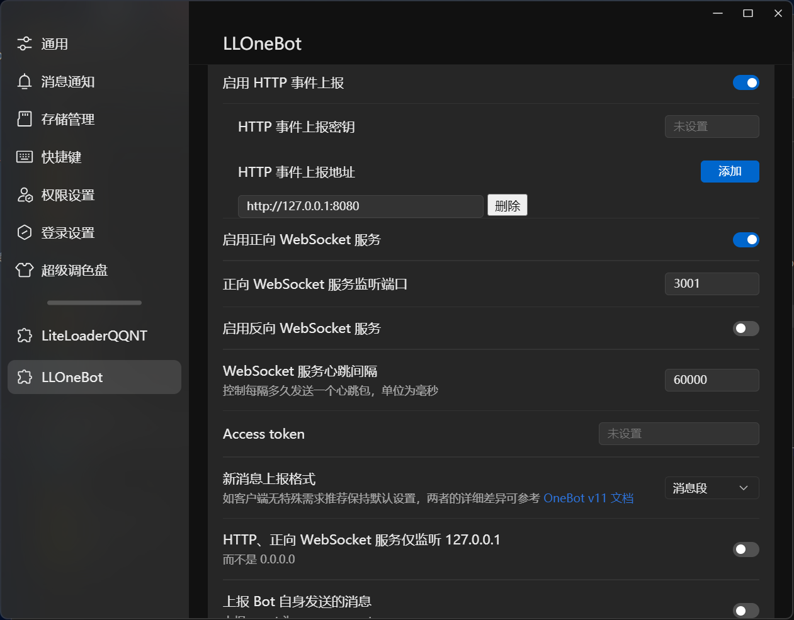

## QAQ: QQ-AI-Quest

本项目用 Rust 语言开发一个智能聊天机器人系统，搭建一安全稳定的服务器存储用户信息和聊天记录，设计 Restful API 路由，集成大模型 API，实现与大模型的交互逻辑，利用 LLOneBot 与后端服务对接，为用户提供智能化的聊天体验。

_目前仍在开发中_

## 目前支持 AI：deepseek，doubao

#### 使用说明

请自行下载 [LLOneBot](https://github.com/LLOneBot/LLOneBot) 搭载的 QQNT，同时设置消息转发端口 8080(默认)    
      
     
    
 
请自行配置大模型的 API KEY [Deepseek API KEY](https://platform.deepseek.com/api_keys) [Doubao API KEY](https://www.volcengine.com/product/ark)     
如果未安装 npm 请上网搜索并安装 Node.js

- windows: 运行 start.bat
- linux: 运行 start.sh

请注意需要自己打开前端窗口 localhost:5173(默认)修改参数，当然也可以直接修改[config.json](config.json)
